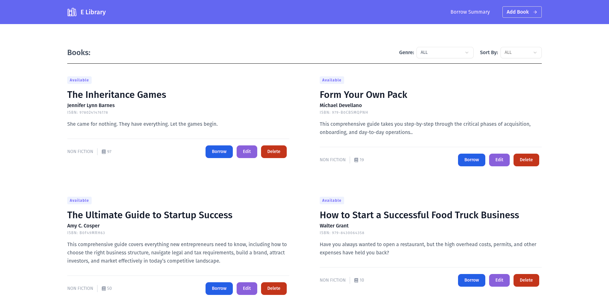

# Library Management System

A full-stack web application for managing a library's book inventory and borrowing system, built with React, TypeScript, Redux Toolkit and Express.js.



## Features

### Frontend

-   Modern and responsive UI built with React and TailwindCSS
-   State management with Redux Toolkit and RTK Query
-   Automatic data caching and cache invalidation with optimistic and pessimistic updates
-   Form handling and validation with React Router actions and React Hook Form
-   Toast notifications for user feedback
-   Pagination and filtering support
-   Loading states and error handling

### Backend

-   RESTful API built with Express.js and TypeScript
-   MongoDB database with Mongoose ODM
-   Complete CRUD operations for books
-   Book borrowing system
-   Query parameters for filtering and sorting
-   Comprehensive error handling
-   Data validation

## Prerequisites

-   Node.js (v16+)
-   pnpm package manager
-   MongoDB database

## Installation & Setup

### Backend

1. Navigate to backend directory:

```bash
cd backend
```

2. Install dependencies:

```bash
pnpm install
```

3. Start the backend server:

```bash
pnpm dev
```

The details of the backend API's can be found [here](https://crimson-robot-330313.postman.co/workspace/536b5db0-0232-427a-8f26-8103a975ce73/collection/29761864-6d258013-4ea2-48af-a45f-f35f0ec49a62?action=share&source=copy-link&creator=29761864).

### Frontend

1. Navigate to root directory.

2. Install dependencies:

```bash
pnpm install
```

3. Start the frontend development server:

```bash
pnpm dev
```

## Key Technologies

-   **Frontend**: React, TypeScript, Redux Toolkit + RTK Query, TailwindCSS, React Router, React Hook Form
-   **Backend**: Express.js, TypeScript, MongoDB + Mongoose

## Project Structure

```
├── src/
│   ├── actions/                  # Route-related action creators
│   ├── app/                      # Complete app configurations
│   │   └── store.ts              # Redux store configuration
│   ├── components/               # Page wise components
│   │   ├── book-summary/
│   │   │   └── BorrowCard.tsx    # Book borrowing card component
│   │   ├── home/
│   │   │   ├── books/           # Book listing components
│   │   │   └── header/          # Header components
│   │   ├── loaders/
│   │   │   ├── BookLoader.tsx    # Book loading skeleton
│   │   │   └── BorrowedCardLoader.tsx
│   │   ├── shared/              # Shared components
│   │   │   ├── BookForm.tsx     # Book creation/edit form
│   │   │   ├── Footer.tsx       # Footer component
│   │   │   ├── FormField.tsx    # Reusable form field
│   │   │   ├── Hamburger.tsx    # Mobile menu button
│   │   │   └── Navbar.tsx       # Navigation bar
│   │   └── ui/                  # UI components
│   │       ├── button.tsx
│   │       ├── calendar.tsx
│   │       ├── pagination.tsx
│   │       └── label.tsx
│   ├── features/
│   │   └── api/                 # API related features
│   │       └── apiSlice.ts      # RTK Query API slice
│   ├── interfaces/              # TypeScript interfaces
│   │   ├── book.interface.ts
│   │   └── borrow.interface.ts
│   ├── lib/
│   │   └── utils.ts            # Utility functions
│   ├── loaders/
│   │   └── bookLoaders.ts      # Route loaders
│   ├── pages/                  # Page components
│   │   ├── AddBook.tsx
│   │   ├── BorrowSummary.tsx
│   │   ├── EditBook.tsx
│   │   └── Home.tsx
│   ├── router/
│   │   └── router.tsx          # Route configurations
│   ├── App.tsx                 # Root component
│   ├── index.css              # Global styles
│   ├── main.tsx               # Entry point
│   └── vite-env.d.ts         # Vite environment types
├── public/                    # Static assets
├── .env                      # Environment variables
├── package.json              # Project dependencies
├── tsconfig.json            # TypeScript configuration
└── vite.config.ts           # Vite configuration
```

### Key Directories

-   **actions/**: Contains action creators for Redux operations
-   **app/**: Redux store setup and configuration
-   **components/**: Reusable React components
    -   **book-summary/**: Components for book borrowing summary
    -   **home/**: Home page components
    -   **loaders/**: Loading skeleton components
    -   **shared/**: Common components used across pages
    -   **ui/**: Base UI components
-   **features/**: Feature-specific code including API slices
-   **interfaces/**: TypeScript type definitions
-   **lib/**: Utility functions and helpers
-   **loaders/**: Route loader functions
-   **pages/**: Main page components
-   **router/**: Routing configuration

This structure follows a page-feature based organization pattern, making it easy to locate and manage related code. Components are organized by page and feature, with common components placed in the shared directory.
